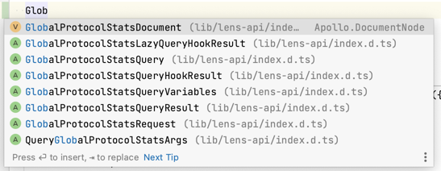

# 🌱 Use Lens
`use-lens/use-lens` is a monorepo that contains packages and CLI with generated GraphQL code for easier Lens API use.

These packages don't change Lens API but simplify usage by providing generated hooks, services, components, etc., for different frameworks.

Find Lens API documentation by the link:

🌿 https://docs.lens.xyz.

Generation is made with awesome package [graphql-code-generator](https://github.com/dotansimha/graphql-code-generator).

## ⚠️ CAUTION
🌿 https://docs.lens.xyz/docs/introduction:
> This API is beta and not production complete yet, which means that we could change schemas and endpoints at any time without warning or notice to you. When this API is production ready, we will remove this beta warning and will endeavor to ensure that there are no changes going forward unless a major change to the protocol itself is required.

Lens API is not production complete, and so is `@use-lens/*`. Please, keep this in mind when going to the production.

The update process of `@use-lens/*` is **manual** because Lens API is currently private, in beta, and doesn't have release schedules, etc.

Also, I would briefly explain how I see the best use of `@use-lens/*` at this point.

## 💻 Contains
- [@use-lens/cli](https://github.com/use-lens/use-lens/tree/main/packages/cli)
- [@use-lens/react-apollo](https://github.com/use-lens/use-lens/tree/main/packages/react-apollo)

Soon:
- `@use-lens/apollo-next`
- `@use-lens/urlq`

## 🤓 Usage

> Works on LTS: https://nodejs.org/en

> All packages and CLI have 2 versions/dist-tags: `@testnet` and `@latest`.
> Install `@testnet` version only if you need some functionality from it(currently, it is only `createProfile`).

Package:

_Detailed explanation found for each package separately._

```
npm install @use-lens/%PACKAGE%
```

---
CLI:

_You must have a Typescript project before running it, because CLI generates *.ts files._

```
npx @use-lens/cli generate %PACKAGE%
```
_or_
```
npm install --save-dev @use-lens/cli
use-lens generate %PACKAGE%
```

Example of `@testnet`: `npm install --save-dev @use-lens/cli@testnet`

### Workflow
- decide what you want to implement
- go to 🌿 https://docs.lens.xyz to check what query or mutation you need to use
- import from `@use-lens/*` what you need
  - document(query or mutation)
  - request / response types
  - hooks for React, services for Angular, etc.

Example:


### Recommended use
If you want **to play with Lens API** - don't hesitate and install some of the `@use-lens/*` packages - it will give you all you need to start.

If you want **to have more control** - use `@use-lens/cli` to generate code locally. CLI would copy essential files that a package contains and run `graphql-codegen`.

You would be able to do more with `codegen.yml`.  
Follow official docs of [graphql-code-generator](https://github.com/dotansimha/graphql-code-generator) to understand how it works.

Find a detailed explanation in the article: [How to Generate Lens API with GraphQL Code Generator](https://blog.andriishupta.dev)

## 👨‍🏫 Examples
- [cli-testnet](https://github.com/use-lens/use-lens/tree/main/examples/cli-testnet)
- [react-apollo](https://github.com/use-lens/use-lens/tree/main/examples/react-apollo)

## ❓️ FAQ
- What happens if Lens breaks changes and I use `@use-lens/*`?  
  I would try to fix it ASAP, but try to do "Emergency eject"(described below)
- Will you update `@use-lens/*` when Lens API is updated?  
  Yes. But currently, Lens API doesn't have a "release schedule", so I would monitor it manually.

### "Emergency Eject"
If something happens with some package and you need to have more control over Lens API Documents, do:
- Remove `@use-lens/*` package
- Run `npx @use-lens/cli generage %PACKAGE%` with the same package you had
- Use generated code instead of the package
- Fix errors in Schema, Queries, Mutations manually as a tmp solution.

To make this smooth, you could try to update **tsconfig.json** with "paths":

https://www.typescriptlang.org/docs/handbook/module-resolution.html

```json lines
{
  "compilerOptions": {
    "baseUrl": "./",
    "paths": {
      "@use-lens/%PACKAGE%": ["./src/use-lens/%PACKAGE%.ts"]
    }
  }
}
```

so you won't need to update import paths to generated code

Example without **tsconfig.json** modification:
```typescript jsx
import { SomethingFromLensAPI } from '../src/use-lens/%PACKAGE%'
```

Example with this simple change in **tsconfig.json**:
```typescript jsx
import { StaysSame } from '@use-lens/%PACKAGE%'
```

## 🧑‍💻 Contribution
The contribution would be closed until there is a need.

### Request improvement to Lens API Documents
Request improvement to Lens API Documents if you see some mismatch or room for improvement. The best way would be to request Query or Mutation changes in the api-examples repo.
Check the "🤝 Lens API Documents" section below for more information.

### Request a feature
Create an issue of what package you want to see. Possible list would fully rely on [graphql-codegen-plugins](https://the-guild.dev/graphql/codegen/plugins).

### Report an issue
Before reporting an issue, please check:
- if it is reproducible on https://api.lens.dev
- if it is a https://github.com/lens-protocol/api-examples issue wrong Query or Mutation
- if your version is up-to-date.

If errors come from outside, I cannot fix the issue in `@use-lens`.

## 🤝 Lens API Documents
The complete set of Lens API Documents has been taken from [api-examples](https://github.com/lens-protocol/api-examples), a repo of 🌿 Lens Protocol that shows how to use Lens API.
The same (or similar) queries are given as examples in Lens API docs.

## 🔎 LICENSE

MIT. The full license text can be found in the LICENSE file.

> ...The above copyright notice and this permission notice shall be included in all
copies or substantial portions of the Software.
